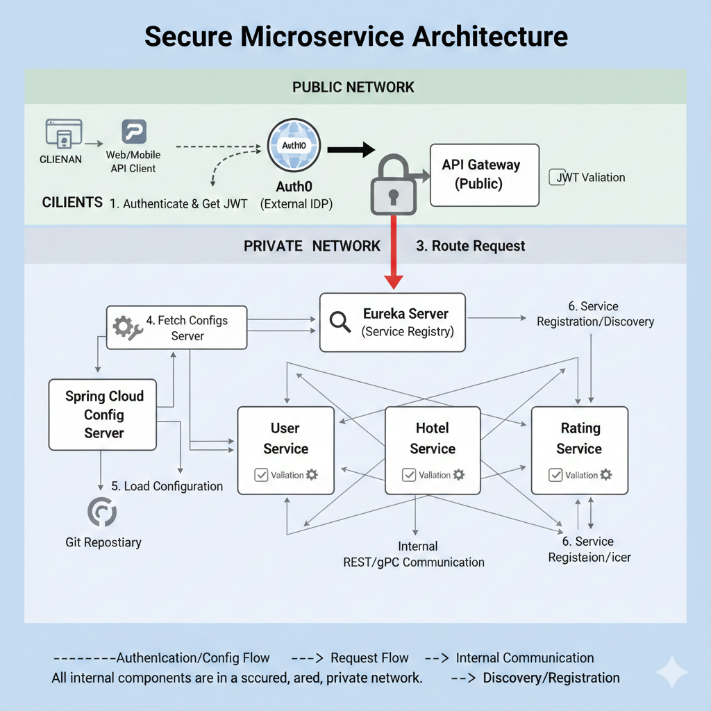

<h1 align="center">🏨 Hotel Ratings Microservices Architecture</h1>

A secure, production-style microservice system built using Spring Boot, Java 17, Auth0, Eureka, API Gateway, Config Server, and inter-service communication.

  <!-- Tech Stack -->
  
  
  
  
  
  
  
  

  <!-- Repo Stats (replace your-username / repo-name) -->
  
  
  
  

---

## 📌 **Architecture Diagram**
Below is the complete system architecture:

